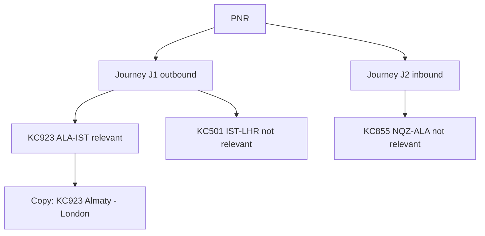

# Journey logic — OLCI open push

## Why `<ENABLE_JOURNEY_LOGIC>` is required

A **flight** is one sector (ALA–IST). A **journey** is the passenger O&D (ALA–LHR via IST).

Online check-in opens against an operating flight, but the passenger thinks in journeys. Without journey logic, `DEPT_CITY`–`ARRV_CITY` on the triggering flight would say Almaty–Istanbul for a London connection. Journey tokens (`JOURNEY_DEPT_CITY`, `JOURNEY_ARRV_CITY`) resolve first-segment origin to last-segment destination.



## Original condition (defect)

```
[for-each journey]
  [if flight.relevant_flight=True and flight.schedule_change<>X]
    <JOURNEY_DEPT_CITY format=city_state>-<JOURNEY_ARRV_CITY format=city_state>
  [/if]
[/for-each]
```

`[for-each journey]` does not replace `flight`. `flight` stays the **triggering** flight for the whole loop. If that flight is relevant and not cancelled, **every journey in the PNR** is printed (outbound and inbound on a return ticket).

## Corrected condition

```
[for-each flight]
  [if flight.relevant_flight=True and flight.schedule_change<>X]
    <CARRIER_CODE><FLIGHT_NUM>
  [/if]
[/for-each]
[for-each journey]
  [if journey.relevant_flight=True and journey.schedule_change<>X]
    <JOURNEY_DEPT_CITY format=city_state> - <JOURNEY_ARRV_CITY format=city_state>
  [/if]
[/for-each]
```

`journey.relevant_flight` is lifted by ENABLE_JOURNEY_LOGIC: true when any child flight is the one this notification is about. `journey.schedule_change=X` only when every sector on that journey is cancelled.

## Deep-link tokens

| Submitted | After engine | Result |
| --- | --- | --- |
| `surname=%7B%7BPAX_LASTNAME%7D%7D` | unchanged | MMB opens with literal `{{PAX_LASTNAME}}` |
| `surname=[encode as='url']<PAX_LASTNAME>[/encode]` | `surname=KASSYM` / `O%27BRIEN` | MMB can resolve the booking |

PNR must use `<PNR>`, not `%7B%7BPNR%7D%7D`.

Do not wrap `[for-each]` / `<TOKENS>` in `[encode as='json-string']`. That is why UAT showed static template text. See [DYNAMIC_PARAMETERS.md](DYNAMIC_PARAMETERS.md).

## Fixture matrix

| Fixture | Original | Corrected |
| --- | --- | --- |
| Direct ALA–NQZ | Flight + city pair OK; URL broken | Flight + city pair OK; URL substituted |
| Connecting ALA–IST–LHR | City pair may be full O&D (wrapper on) but URL broken | `KC923` + Almaty–London |
| Return, outbound open | **Both** city pairs | Outbound only |
| Cancelled relevant | Empty flight/city | Same; suppress send |
| Two relevant sectors | `KC923KC501` | `KC923 KC501` + one city pair |

## 15 Below / Infobip notes

- Leave `<ENABLE_JOURNEY_LOGIC>` wrapped around the whole JSON. Do not put it inside a JSON string.
- Title and body stay inside `[encode as='json-string']` so the body newline does not break FCM JSON.
- Confirm with 15 Below that journey-level `relevant_flight` is the supported flag name. If their schema uses `relevant_journey`, swap only that identifier; keep the same boolean meaning.
- Infobip/FCM delivery is unchanged: this pack only corrects personalisation before the JSON is handed to the push API.
